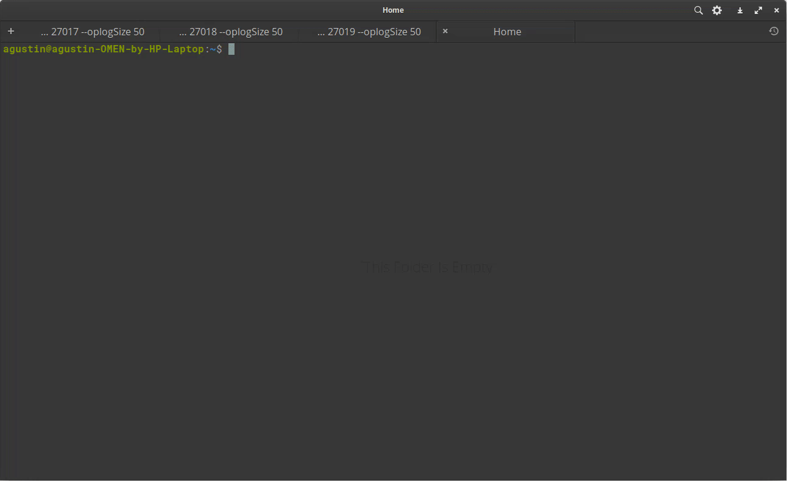

# Trabajo Práctico Nº1

Autor:

* Agustín Curcio Berardi

Docente:

* Yoel Yamil López

**1. Implementar en MongoDB un `replica set` con 3 servidores que contengan la información de la base de datos finanzas. Un nodo `PRIMARY`, un `SECONDARY` y un `ARBITER`.**

Antes de inicializar las tres instancias de `mongod` vamos a crear los siguientes directorios:

    ├── data                # Directorio raíz para almacenar los datos.
        └── db              # Directorio para los datos de la base de datos.
            └── rs          # Directorio para las instancias que conformarán el replica set.
                ├── 0       # Directorio donde la instancia PRIMARY almacenará sus datos.
                ├── 1       # Directorio donde la instancia SECONDARY almacenará sus datos.
                └── 2       # Directorio donde la instancia ARBITER almacenará sus datos.

Para ello, en una consola hacemos lo siguiente:

    mkdir data && cd data
    mkdir db && cd db
    mkdir rs && cd rs
    mkdir 0 1 2

Lo mismo se aprecia en el siguiente video:

Luego resta instanciar las tres instancias de `mongod` de la siguiente manera.

    mongod --replSet rs --dbpath /data/db/rs/0 --port 27017 --oplogSize 50
    mongod --replSet rs --dbpath /data/db/rs/0 --port 27018 --oplogSize 50
    mongod --replSet rs --dbpath /data/db/rs/0 --port 27019 --oplogSize 50

En la siguiente animación se observa como se reemplazan los `--dbpath` por los directorios correspondientes.

**2. Conectarse al nodo PRIMARY.**

Ahora para configurar e inicializar el "replica set", tenemos que conectarnos desde un cliente de Mongo al nodo PRIMARY. Para ello:

    mongo --port 27017

Una vez conectados, definimos la variable `cfg`, la cual contendrá la estructura de nuestro "replica set". El parámettro `_id` define el nombre del "replica set" mientras que `members` contiene a los servidores miembros de dicho conjunto.

    cfg = {
            _id:"rs",
            members:[
                {_id:0, host:"localhost:27017"},
                {_id:1, host:"localhost:27018"},
                {_id:2, host:"localhost:27019", arbiterOnly:true}
            ]
    };

Por último, se requiere ejecutar el método `rs.initiate()` para inicializar el "replica set", pasándole como parámetro la estructura que contiene la configuración del mismo.

    rs.initiate(cfg)

Todo esto lo podemos observar en la siguiente animación:

Por defecto, MongoDB reconoce al nodo como SECONDARY. Apretamos `Enter` para que se reconfigure y tome ahora si al nodo como PRIMARY.

**3. Crear la base de datos `finanzas`.**

Como se necesita crear una base de datos utilizando datos de sensores IoT, se creará la base de datos `cosmic`.

Para rellenar la base de datos con información, vamos a utilizar la estructura de datos que es empleada en el proyecto [Cosmic Pi](http://cosmicpi.org/). El mismo tiene como objetivo construir el telescopio de rayos cósmicos distribuido más grande del mundo. Al ser un proyecto de código abierto, utilizaremos la estructura de datos que generan los sensores y la completaremos con información ficticia. Dichos datos se encuentran definidos en `sensors.js`.

**4. Ejecutar el script `facts.js` cuatro veces para crear volumen de datos.**

Se utilizaron algunos de los campos que son enviados por los detectores de Cosmic Pi, tal cual se aprecia en el [repositorio oficial](https://github.com/CosmicPi/grafana_dashboards). Se generaron diez registros para dos sensores ficticios, los cuales se incluyeron en el archivo `sensors.js`. Para importarlos a la base de datos, solamente tenemos que correr el comando:

    load("sensors.js")

Tal cual se aprecia en la siguiente animación:

**5. Buscar los datos insertados en el nodo PRIMARY.**

Para buscar los datos en el nodo primario, simplemente ejecutamos el comando:

    db.sensores.find()

Los datos que arroja dicho comando se pueden observar en el siguiente video.

**6. Buscar los datos insertados en el nodo SECONDARY.**

Para buscar los datos en el nodo secundario, primero nos conectamos  a él.

    mongo --port 27018

Antes de poder traer información, debemos ejecutar el comando `rs.secondaryOk()` para que MongoDB habilite operaciones de lectura por parte del nodo secundario y pueda llevarse a cabo así la replicación. Para ello, ejecutamos el comando en cuestión:

    rs.secondaryOk()

En esta instancia ya deberían estar copiados los datos al nodo secundario. Para buscarlos, primero simplemente seleccionamos la base de datos:

    use cosmic

Y por último mostramos los datos con el comando:

    db.sensores.find()

Todo el proceso se muestra a continuación:

**7. Realizar un ejemplo de "Fault Tolerance", simulando una caída del servidor PRIMARY.**

Con el objetivo de mostrar un ejemplo de tolerancia a fallas, debemos disparar de algún modo el mecanismo de "failover". De esta manera, ante eventuales fallas que puedan ocurrir en el nodo primario, el sistema debería reaccionar y automáticamente seleccionar un nuevo nodo como primario.

Por este motivo, primero vamos a interrumpir la ejecución del nodo primario con la señal `Ctrl+C`. Luego vamos a verificar que en el cliente conectado a dicho nodo la comunicación se perdió, por ejemplo ejecutando `show dbs`. Y por último vamos a ver como el nodo secundario ahora se convierte en primario. Toda la secuencia de muestra debajo de estas líneas.

Así se pudo comprobar que de forma "transparente" para el usuario, el sistema realizó una votación entre los nodos que se encontraban activos y se seleccionó al nodo secundario como nuevo primario.

A continuación vamos a cargar nuevos datos en el nuevo nodo primario, que de ahora en más lo vamos a llamar primario*. Vamos a crear la base `cosmic1` y vamos a cargar los mismos datos que se encuentran en el archivo `sensors1.js`.

Como se pudo ver, el nodo primario* aceptó operaciones de escritura (si fuera secundario, esto no hubiera sido posible). Por lo que ahora si volvemos a inicializar el nodo primerario, la información debería replicarse luego de ejecutar el comando `rs.secondaryOk()`, ya que solamente lo ejecutamos en el nodo secundario original.

El proceso completo de muestra a continuación:

